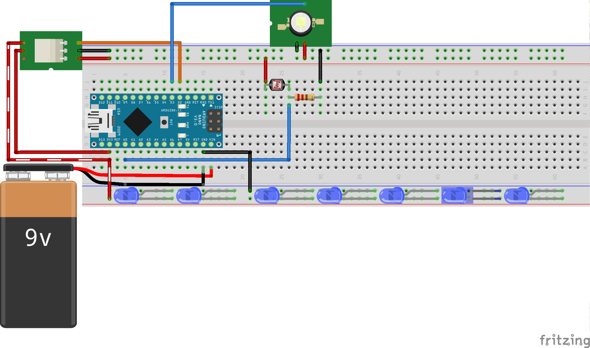

# Night movement lamp

The idea for this project came after a couple of times I bumped into object in
the middle of the night when I was trying to go to the toilette.

*NOTE*: This is one of my first arduino projects, so any feedback is welcome :)

### Used materials:

The materials that I used are equivalent to the ones in that list. Note that
when I was creating the list, I was not trying to find the least expensive
parts. I just found some element that would work for me and I linked it here to
make it easier to find the appropriate elements later.

* [Arduino Nano][0]
* A breadboard
* Wires
* Battery holder and batteries
* [5V 1 canal H/L Level Triger Relais][1]
* [photoresistor][2] 
* [Passive infrared sensor (PIR)][3] 
* [220 Ohm resistor][4]
* couple of [LEDs][5]

# Wiring

An example wiring (note that the scheme is approximative).

[0]: https://www.amazon.fr/gp/product/B00QPUEFNW/ref=oh_aui_detailpage_o03_s00?ie=UTF8&psc=1
[1]: https://www.amazon.fr/gp/product/B00PN5RITI/ref=oh_aui_detailpage_o00_s00?ie=UTF8&psc=1
[2]: https://www.amazon.fr/qualit%C3%A9-Lumi%C3%A8re-r%C3%A9sistance-d%C3%A9pendant-photor%C3%A9sistance/dp/B00NXW9WZ6/ref=sr_1_3?ie=UTF8&qid=1508012609&sr=8-3&keywords=arduino+photoresistance
[3]: https://www.amazon.fr/Tenflyer-HC-SR501-Mouvement-D%C3%83%C2%A9tecteur-Infrarouge/dp/B016KCSUK8/ref=sr_1_4?s=electronics&ie=UTF8&qid=1508012664&sr=1-4&keywords=pir+sensor
[4]: https://www.amazon.fr/Just-Honest-Pi%C3%A8ces-R%C3%A9sistances-Resistor-0-25W/dp/B016S2LZB6/ref=sr_1_2?s=electronics&ie=UTF8&qid=1508012751&sr=1-2&keywords=resistance+220+ohm
[5]: https://www.amazon.fr/Elegoo-Composants-Electronique-R%C3%A9sistances-Potentiometre/dp/B06XKR7HZK/ref=sr_1_5?s=electronics&ie=UTF8&qid=1508013279&sr=1-5&keywords=arduino%2Bled&th=1
